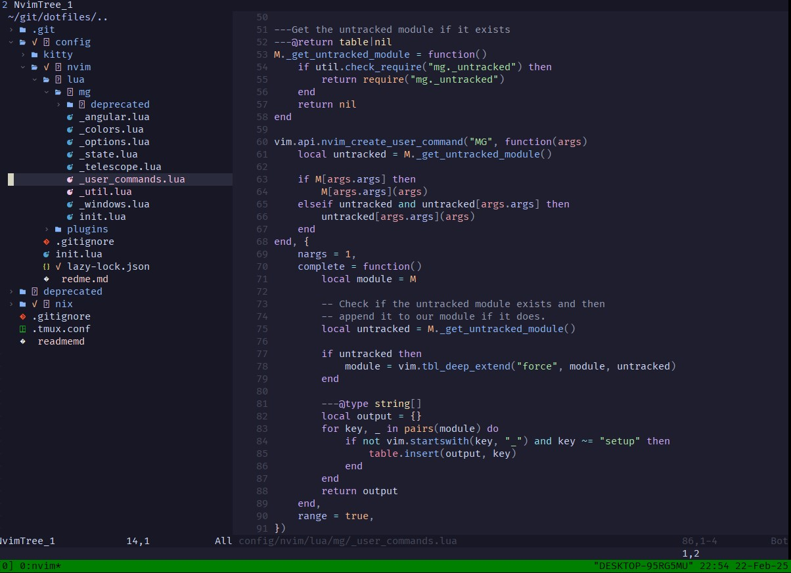
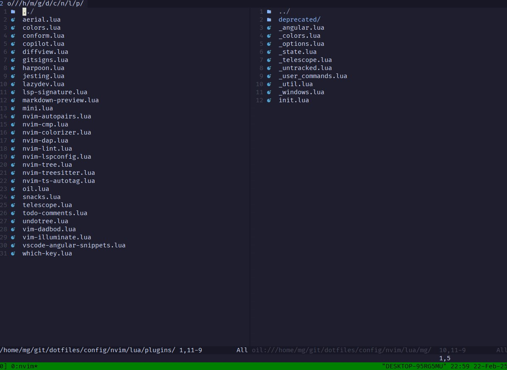
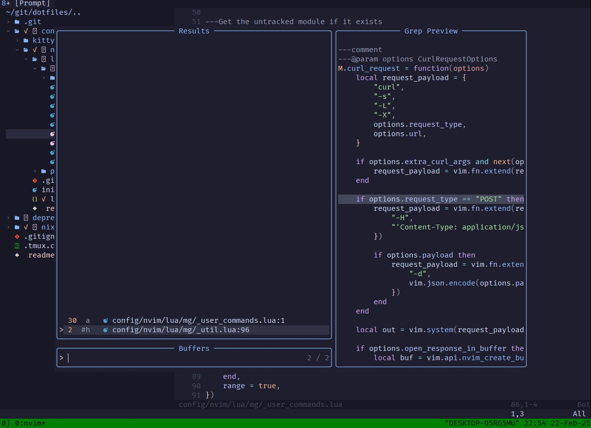
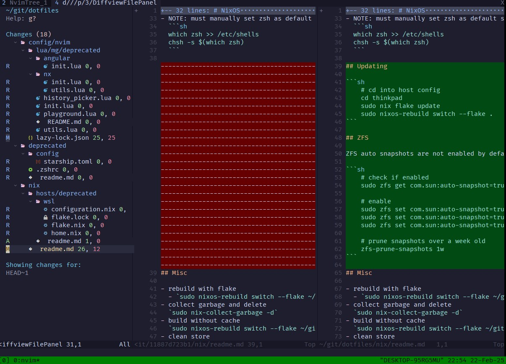

# Dotfiles

These are my dotfiles. They are actively updated and reflect my current development environment.

- Clone to `~/git/dotfiles`
- Neovim - [view files](./config/nvim)
- Nix - [view files](./nix)

## Neovim

Here's an example of what my Neovim looks like.
I use many more additional plugins, [which are located here](./config/nvim/lua/plugins).

### Oil

### Telescope

### Diffview

